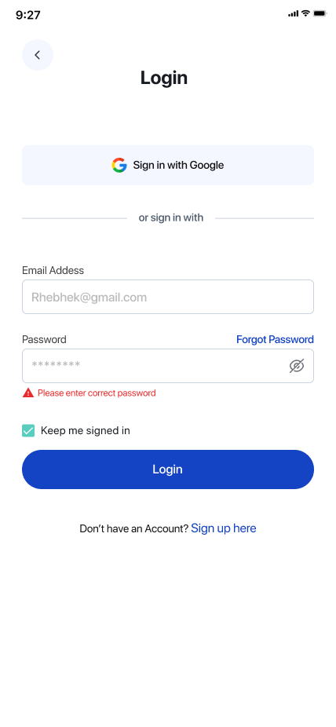
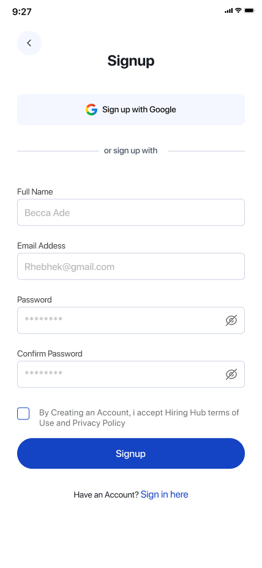

# Auth UI (Expo / React Native)

UI d'authentification réalisée avec Expo + Expo Router.

## Fonctionnalités

- **Login**
- **Sign Up**
- **Forgot Password**
- **Verify Email (OTP)**
- **Navigation** via Expo Router (file-based routing)
- **Support clavier / scroll** (KeyboardAvoidingView + ScrollView)
- **Safe Area** (SafeAreaProvider + SafeAreaView)

## Stack

- Expo
- React Native
- Expo Router
- react-native-safe-area-context

## Démarrage

1. Installer les dépendances

```bash
npm install
```

2. Lancer le projet

```bash
npx expo start
```

Ensuite, ouvre l'app sur :

- Expo Go
- Android Emulator
- iOS Simulator

## Structure des routes

Les écrans se trouvent dans `app/` (Expo Router) :

- `app/index.tsx` : Login
- `app/sign-up.tsx` : Sign Up
- `app/forgot-password.tsx` : Forgot Password
- `app/verify-email.tsx` : Verify Email

## Captures

### Login

> Ajoute le fichier `assets/images/log-in.png` (ou renomme ton image) pour que la capture s'affiche ici.



### Sign Up


